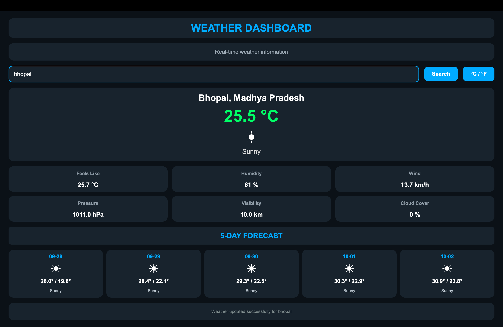

# Weather Dashboard – Python

A Python-based weather dashboard developed using PyQt5 and REST API integration to display current weather conditions and a 5-day forecast.

## Features

- Real-time weather information
- City-based weather search
- Current temperature and weather condition
- Feels-like temperature
- Humidity
- Wind speed
- Atmospheric pressure
- Visibility
- Cloud cover
- 5-day weather forecast
- Celsius/Fahrenheit temperature conversion

## Technologies Used

- Python
- PyQt5
- Requests
- REST API

## Project Files

- `weather_app_v2.py` – Main Python application
- `requirements.txt` – Required Python packages
- `weather-dashboard.png` – Dashboard screenshot

## Dashboard Preview



## How to Run

Install the required packages:

```bash
pip install -r requirements.txt
